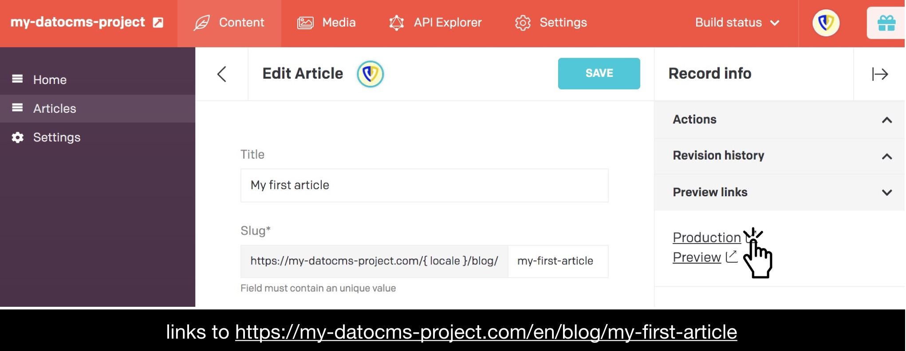
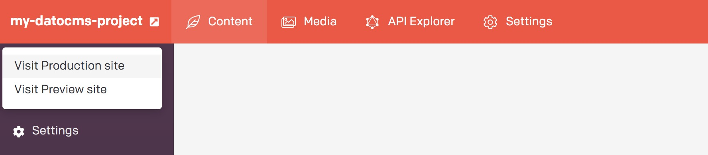
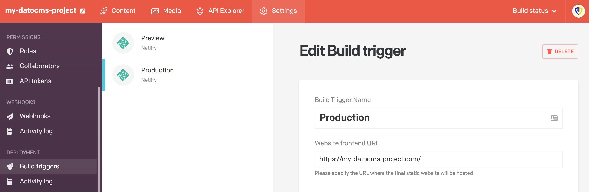
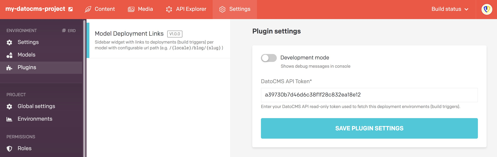
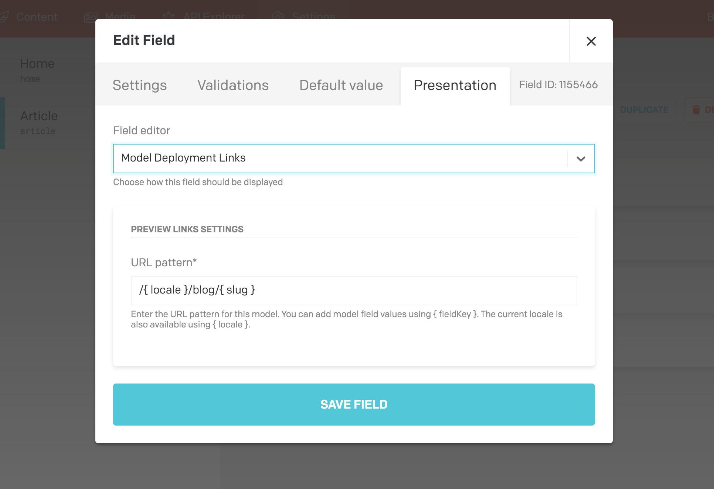

# DatoCMS plugin: Model Deployment Links

**This DatoCMS plugin adds a sidebar widget with links to deployments (build triggers) _per model with configurable url path_ (e.g. `/{ locale }/blog/{ slug }`), so your editors can easily view the item they are editing.**

## Features

* Supports customisable URLs per model in your CMS.
* Supports single and multi-language instances.
* Supports multiple deployment environments (build triggers).

## Background

By default DatoCMS already links to your depoyment environments in the main menu:

These items link to the **Website frontend URL** you entered for the related build trigger:

This plugin adds links to **model-specific URLs** on those websites:

The sidebar shows a link for each deployment environment. The URL is based on the form values of the item being edited and optionally the current locale.

This enables your editors to directly view the item they are editing.

## Configuration

First add this plugin via DatoCMS Settings > Plugins > Add (`/admin/plugins/new`).

### Global plugin settings

Then enter the DatoCMS API read-only token used to fetch this deployment environments (build triggers):

This token is available via Settings > API Tokens > Read-only API token (`/admin/access_tokens/`).

### Model specific settings

Add the sidebar widget to a model by adding a **JSON field** and setting the presentation to **Model Deployment Links**:

Enter the URL pattern for this model. You can add model field values using `{ fieldKey }`. The current locale is also available using `{ locale }`.

This results in **model-specific URLs** in the sidebar of your content page:

---

## Contributing

See [contributing.md](contributing.md).

## Credits

Scaffolded using [DatoCMS plugin Yeoman generator](https://github.com/datocms/generator-datocms-plugin).

## License

[MIT Licensed](license) by [De Voorhoede](https://www.voorhoede.nl).
